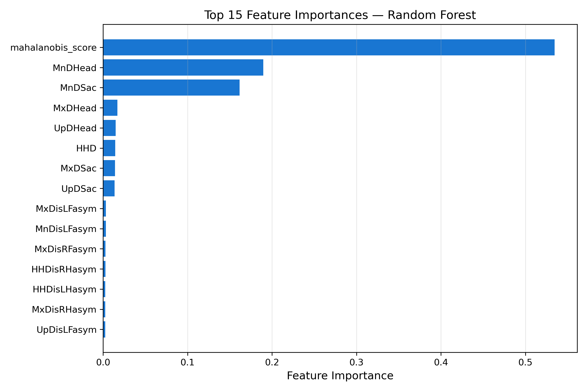
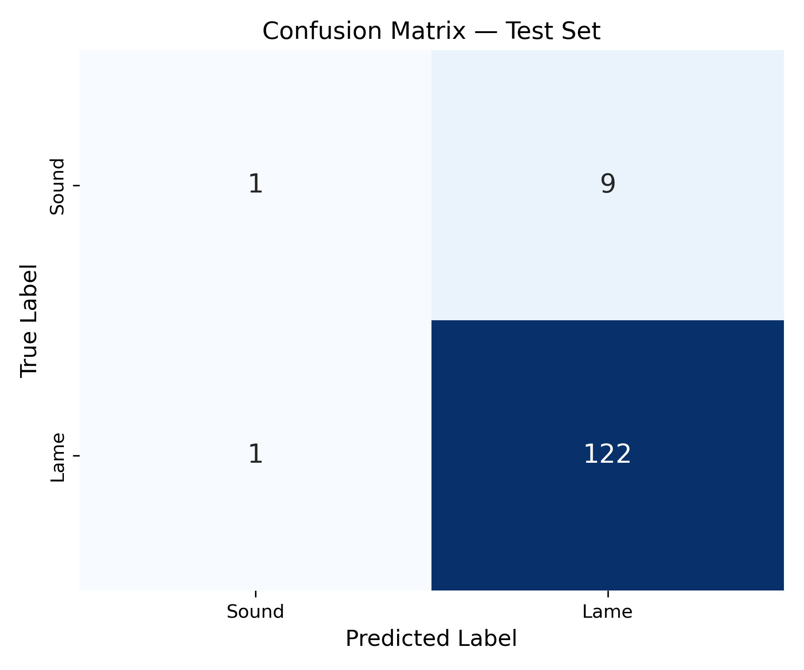
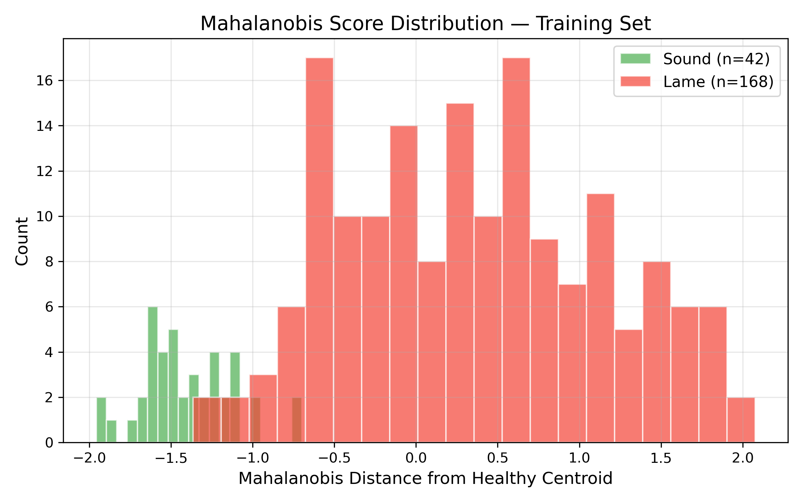
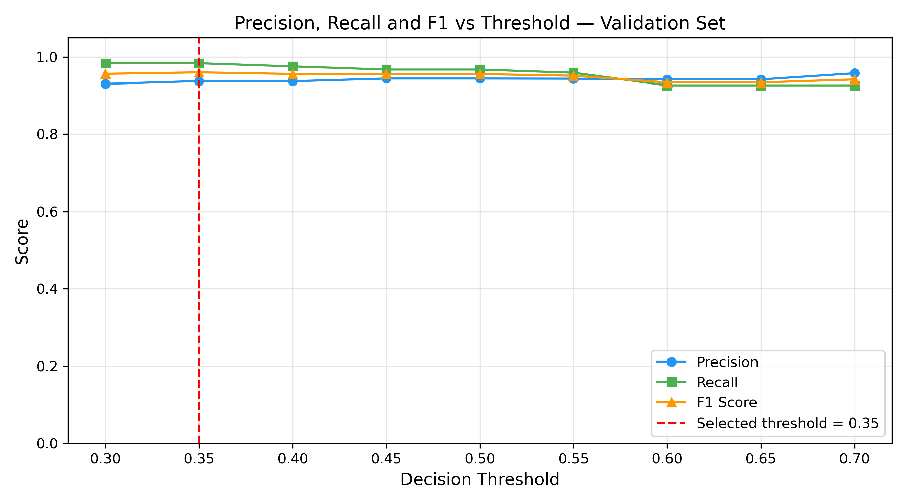
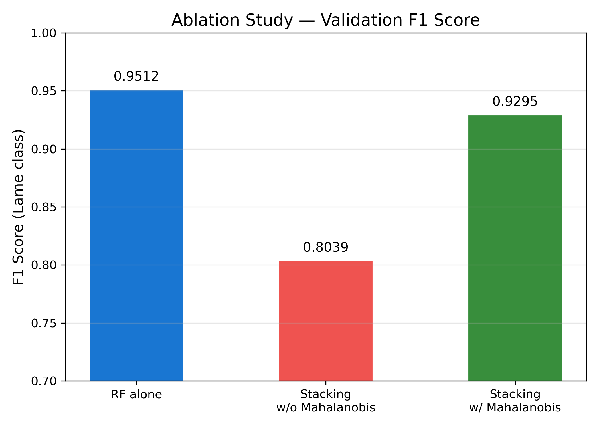
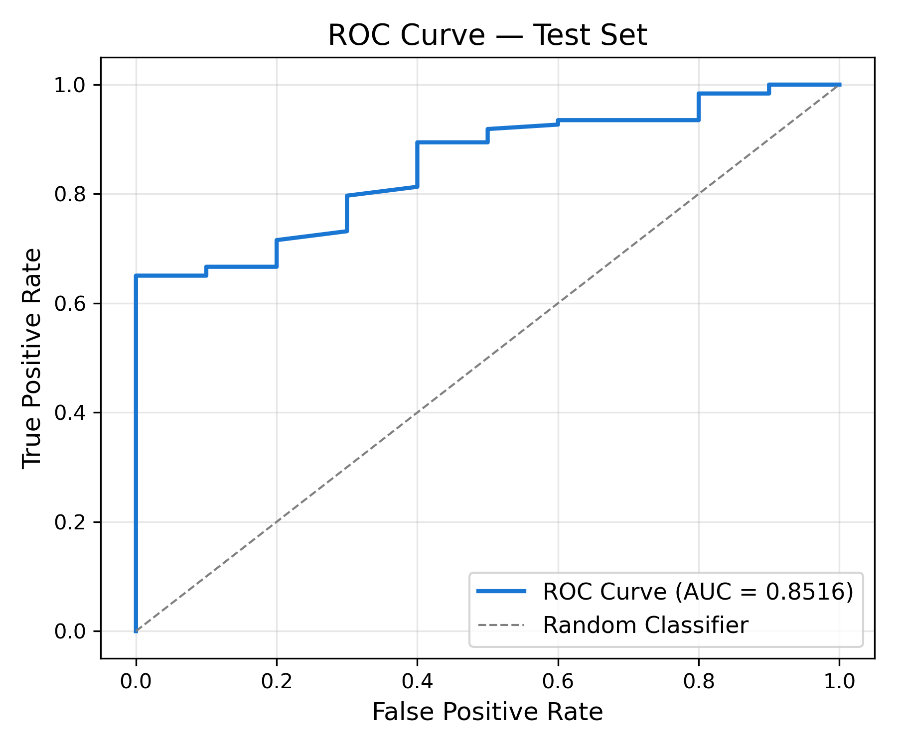

# EquiGuard

Automated lameness detection in Thoroughbred racehorses using IMU gait asymmetry measurements and a novel Mahalanobis distance feature.

**The short version:** A single engineered feature — Mahalanobis distance from the healthy horse population centroid — contributed 53.76% of the model's decision making, more than all 28 clinical asymmetry columns combined. The final Random Forest catches 122 of 123 lame horses in the held-out test set.

## The Problem This Solves

Lameness affects the majority of Thoroughbred racehorses in active training, often before it becomes visible to the human eye. A horse with subclinical lameness — movement asymmetry above clinical thresholds but no obvious gait abnormality — will continue competing and risk worsening injury. Current detection relies on a veterinarian watching the horse trot. That is subjective, inconsistent, and does not scale.

IMU sensors mounted at the head and sacrum measure asymmetry directly. The question this project asks: can a machine learning model trained on those measurements reliably identify lameness — and do so without the methodological shortcuts that inflate results in most comparable published systems?

## What We Built Differently

Most published lameness detection systems split data randomly across rows. This causes the same horse to appear in both training and test sets. The model partially recognises horses it has already seen, producing inflated accuracy that does not reflect real clinical performance.

EquiGuard splits at the horse identifier level. No horse's measurements appear in more than one partition. This was verified programmatically — the intersection of horse IDs across all three splits returned zero.

The benchmark system (Yigit et al. 2022) reported 94.4% accuracy on 16 horses with random splitting. EquiGuard reports 92.5% accuracy on 307 horses with identity-safe splitting. The lower number is the more honest one.

## The Feature That Did The Work

Before modelling, we engineered one additional feature: the Mahalanobis distance of each horse from the centroid of the healthy training population.

$$D_M(x)=\sqrt{(x-\mu)^T\Sigma^{-1}(x-\mu)}$$

Where $\mu$ and $\Sigma$ are computed from the 42 confirmed-sound training horses. This single scalar answers the question: how far is this horse from normal, accounting for all feature correlations?

The covariance matrix was singular — 42 samples and 28 features means rank deficiency is guaranteed. Moore-Penrose pseudo-inverse was used as a valid mathematical fallback.

Validation confirmed clinical validity before the feature entered the model:
* **Sound horses:** mean distance of 4.800
* **Lame horses:** mean distance of 8.614

Feature importance after training:
* **Mahalanobis Distance:** 53.76%
* **MnDHead:** 18.56%
* **MnDSac:** 15.79%



The model independently rediscovered what Keegan 2007 identified as the primary clinical lameness indicators — through pure data-driven impurity reduction.

## What Went Wrong During Development

The first pipeline implementation used both datasets as training features. Gmel EQUIMOVES measures limb kinematics — protraction, retraction, abduction angles. Figshare B measures head and pelvis displacement asymmetry. These are physically different quantities from different sensor placements. The intersection of usable feature columns between the two datasets was zero.

The feature matrix had shape `(1840, 0)`. Every horse. Zero features. The training set was completely empty.

Fixing this required abandoning the original multi-dataset feature strategy entirely. Gmel was retained only for computing the healthy population centroid. Figshare B asymmetry columns became the sole feature source for all three splits. After this redesign, shared features returned 28. The pipeline worked.

That bug cost two days and produced a better methodological design than the original plan.

## Results

Evaluated once on a held-out test set of 133 horses that the model had never seen during training or threshold selection.

* **Lame Recall:** 99.2% (122 of 123 lame horses caught)
* **Lame Precision:** 93.1%
* **Lame F1:** 96.1%
* **Accuracy:** 92.5%
* **ROC-AUC:** 0.8516

### Visualizations

### Confusion Matrix



### Feature Importance


### Mahalanobis Distance Distribution



### Threshold Optimization



### Ablation Study



### ROC Curve


> **Note on Sound Class Recall:** The sound class recall is 10%. This reflects a dataset constraint — only 10 confirmed-sound horses were available in the test set. One correct prediction changes sound recall by 10 percentage points. This metric should not be interpreted as model performance on sound classification.

**Ablation study on validation set:**
* RF alone: $F1 = 0.9512$
* Stacking + Mahalanobis: $F1 = 0.9295$
* Stacking without Mahalanobis: $F1 = 0.8039$

Removing the Mahalanobis feature dropped ensemble F1 by 12.56 percentage points.

## Dataset

**Primary: Figshare B — Martel 2024**
* 307 Thoroughbred racehorses (156 from Singapore Turf Club, 151 from Hong Kong Jockey Club)
* Funded by The Hong Kong Jockey Club Equine Welfare Research Foundation and the Horserace Betting Levy Board
* Labels generated using Keegan 2007 clinical thresholds:
    * `label = 1` if $|MnDHead| > 6\text{mm}$ OR $|MnDSac| > 3\text{mm}$
    * `label = 0` otherwise
* 79.8% lame rate. Clinically expected in elite racing populations. Not a labeling error.

**Secondary: Gmel EQUIMOVES — Braganca et al.**
* 428 confirmed-sound horses
* Used only for Mahalanobis healthy centroid computation

## Reproduce

```bash
git clone https://github.com/akashphogat/EquiGuard.git
cd EquiGuard
pip install -r requirements.txt
```